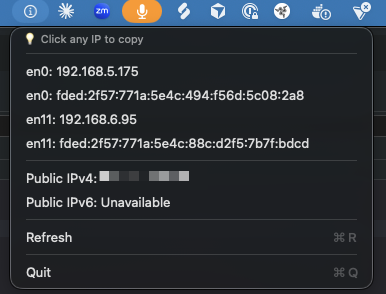
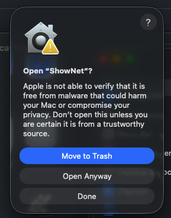

# ShowNet

A lightweight macOS menu bar app that displays your network status and IP addresses.

Clicking on the info copies to the clipboard.


## Features

- 🌐 Displays all local network interfaces (IPv4 and IPv6)
- 🌍 Shows your public IPv4 and IPv6 addresses
- 📋 Click any IP to copy it to clipboard
- 🔄 Refresh button to update network status
- 🎯 Lightweight and native - no external dependencies

## Screenshots



## Installation

### Option 1: Download Pre-built App (Easiest)

1. Download `ShowNet.app.zip` from the [latest release](https://github.com/yourusername/show-net/releases)
2. Unzip and drag `ShowNet.app` to your `/Applications` folder
3. Allow the app in your Privacy & Security settings


4. Confirm ("Launch Anyway")



5. Look for the animated 'i' in your menu bar

### Option 2: Build from Source

#### Requirements
- macOS 11.0 or later
- Xcode Command Line Tools (`xcode-select --install`)

#### Build Steps

```bash
# Clone the repository
git clone https://github.com/aflansburg/show-net.git
cd show-net

# Open in Xcode and build
open ShowNet/ShowNet.xcodeproj

# Or build from command line
xcodebuild -project ShowNet/ShowNet.xcodeproj -scheme ShowNet -configuration Release

# Launch
open build/Release/ShowNet.app
```

## Usage

Once installed, you'll see an animated 'i' icon in your menu bar. Click it to view:

- **Local Network Interfaces** - All active connections with their IPv4 and IPv6 addresses
- **Public IPv4** - Your external IPv4 address (click to copy)
- **Public IPv6** - Your external IPv6 address if available (click to copy)
- **Refresh** - Update network status (⌘R)
- **Quit** - Exit the app (⌘Q)

### Clicking IPs

Click any IP address in the menu to instantly copy it to your clipboard. The menu item will briefly show "✓ Copied!" to confirm.

## How It Works

ShowNet uses native macOS commands to gather network information:

1. **Local IPs**: Reads from `ifconfig` to display all network interfaces
2. **Public IPs**: Uses `curl` with IPv4/IPv6 forcing to query `ifconfig.me`


## Permissions

This app requires:
- **No special permissions** - reads network info that's already accessible
- **Network access** - to fetch your public IP addresses
- No administrator privileges needed
- No data collection or analytics

## Development

### Project Structure

```
show-net/
├── ShowNet/
│   └── ShowNet/
│       ├── AppDelegate.swift  # Main app code
│       └── main.swift         # App entry point
├── LICENSE
└── README.md
```

### Building for Distribution

To create a distributable build:

```bash
xcodebuild -project ShowNet/ShowNet.xcodeproj \
    -scheme ShowNet \
    -configuration Release \
    CONFIGURATION_BUILD_DIR="$(pwd)/build" \
    clean build

  cd build
  zip -r ShowNet.app.zip ShowNet.app
```

---

**Note**: This app is read-only and does not modify any system settings. It simply displays network information.
